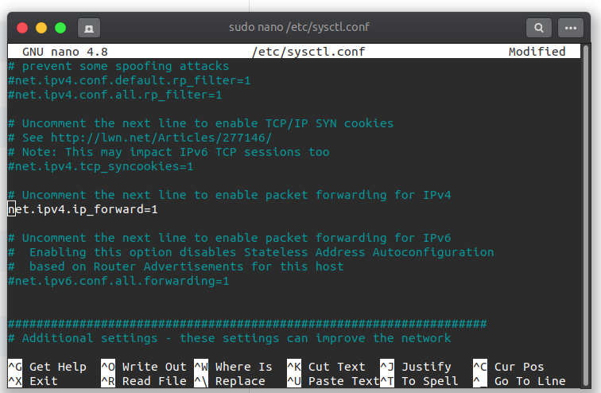
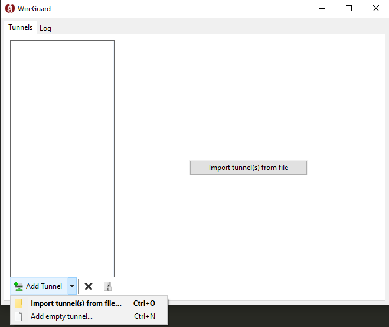
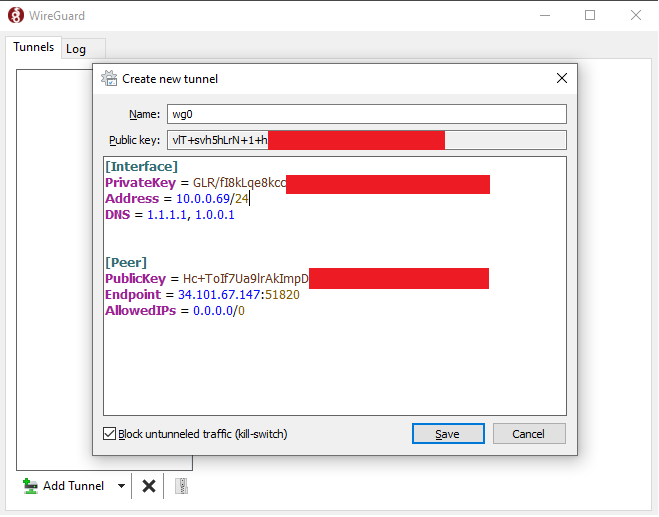
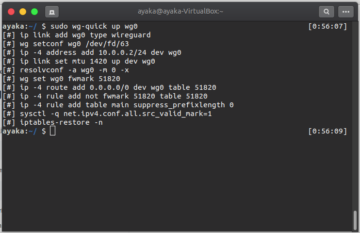
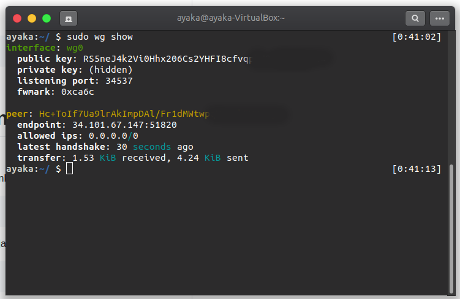
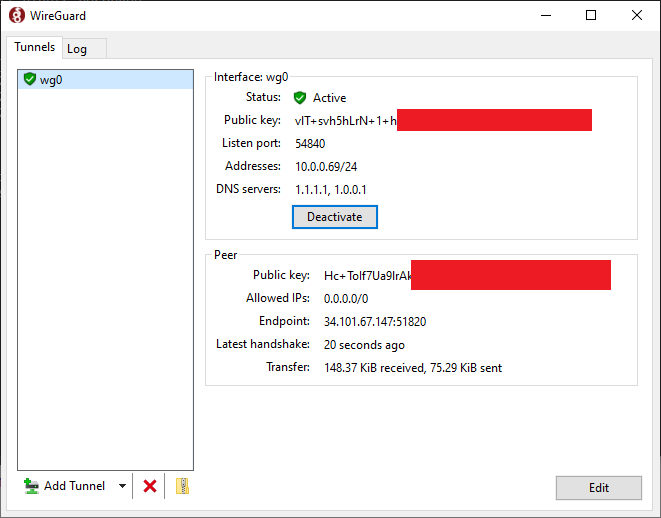

[WireGuard](#WireGuard) | [Instalasi](#instalasi-WireGuard) | [Set up WireGuard pada Server](#set-up-wireguard-pada-server) | [Set up WireGuard pada Client](#set-up-wireguard-pada-client) | [Menghubungkan Client dengan VPN](#menghubungkan-client-dengan-vpn-wireguard) | [Troubleshooting](#troubleshooting) | [Dis/advantages](#kelebihan-dan-kekurangan-wireguard) | [Referensi](#referensi) |
:---:|:---:|:---:|:---:|:---:|:---:|:---:|:---:


# WireGuard
[`kembali ke atas`](#)


**WireGuard** merupakan salah satu VPN (*Virtual Private Network*) sederhana namun cepat dan modern yang menggunakan *cryptography* yang canggih. WireGuard adalah proyek open source terbaru yang mempercepat VPN sambil membuatnya lebih aman dari sebelumnya. Secara eksplisit protokol ini diklaim lebih baik dari protokol OpenVPN dan IPsec. Awalnya dirilis hanya untuk sistem operasi Linux tetapi sekarang kompatibel dengan banyak platform lain.

# Instalasi WireGuard
[`kembali ke atas`](#)

### Ubuntu / Debian
Untuk menginstall pada distro Ubuntu atau Debian jalankan printah:
```bash
$ sudo apt-get update; sudo apt-get upgrade -y
$ sudo apt-get install wireguard -y
```

### Windows (Client)
Unduh dan install programnya pada [link](https://download.wireguard.com/windows-client/wireguard-installer.exe) berikut.

### Sistem Operasi Lainnya
Instalasi program pada sistem operasi lainnya dapat dilihat pada [Installation Page WireGuard](https://www.wireguard.com/install/).

# Set up WireGuard pada Server
[`kembali ke atas`](#)

### Membuat Private dan Public Keys
WireGuard bekerja dengan cara mengenkripsi koneksi diantara client dan server dengan sepasang *cryptographic keys* bernama *public key* dan *private key*. Koneksi yang dilakukan antara client dan server akan dienkripsi dengan menggunakan public key milik pihak tujuan dan hanya dapat dibaca dengan mendekripsinya dengan private key yang dimilik pihak tujuan.

Untuk melakukan generate key jalankan perintah:
```bash
$ wg genkey | sudo tee /etc/wireguard/privatekey | wg pubkey | sudo tee /etc/wireguard/publickey
```
Perintah ini akan membuat file `privatekey` dan `publickey` yang tersimpan di directory `/etc/wireguard`. Simpan `privatekey` dan jangan di*share* ke siapapun.

### Membuat File Konfigurasi Server
Buat file konfigurasi berekstensi `.conf` dengan nama apapun (disini kita gunakan ```wg0.conf```) dengan menjalankan perintah:
```bash
$ sudo nano /etc/wireguard/wg0.conf
```
Kemudian pada file ```wg0.conf``` buat interface seperti berikut:
```apacheconf
[Interface]
Address = 10.0.0.1/24
SaveConfig = true
ListenPort = 51820
PrivateKey = SERVER_PRIVATE_KEY
PostUp = iptables -A FORWARD -i %i -j ACCEPT; iptables -t nat -A POSTROUTING -o enp0s3 -j MASQUERADE
PostDown = iptables -D FORWARD -i %i -j ACCEPT; iptables -t nat -D POSTROUTING -o enp0s3 -j MASQUERADE
```
Penjabaran Interface sebagai berikut :

- *Address* - Alamat IPv4 atau IPv6 yang digunakan sebagai identifikasi server pada network WireGuard.
- *SaveConfig* - Jika diset *true*, akan menyimpan konfigurasi interface yang digunakan ketika WireGuard dimatikan .
- *ListenPort* - Port yang digunakan untuk menerima connection.
- *PrivateKey* - Yaitu PrivateKey yang digunakan oleh server dan didapatkan dari generate key yang telah dilakukan.
- *PostUp* - Merupakan perintah yang akan dijalankan sebelum mengaktifkan interface WireGuard.
- *PostDown* - Merupakan perintah yang akan dijalankan sebelum mematikan interface WireGuard.

Untuk penjabaran konfigurasi WiregGuard lebih lanjut dapat diakses pada [ManPages wg-quick](https://manpages.debian.org/unstable/wireguard-tools/wg-quick.8.en.html#CONFIGURATION)

Sebelum menjalankan pastikan mengganti ```enp0s3``` dengan nama public interface yang ada pada device. Untuk mengetahuinya dapat dengan cara menjalankan:
```bash
$ ip -o -4 route show to default | awk '{print $5}'
```

Command yang digunakan pada bagian `PostUp` dan `PostDown` berfungsi untuk membuka dan meneruskan *request* client kepada suatu server/webservice sehingga client yang terkoneksi ke server WireGuard dapat mengakses internet.

Untuk membuat wg0.conf dan privatekey tidak bisa dilihat untuk normal user maka ganti permission mejadi 600:
```bash
$ sudo chmod 600 /etc/wireguard/{privatekey,wg0.conf}
```

### Menjalankan Interface WireGuard
Setelah selesai membuat konfigurasi, maka interface wg0 dapat dijalankan dengan perintah:
```bash
$ sudo wg-quick up wg0
```

Untuk melihat apakah berjalan atau tidak dan client yang terkoneksi pada:
```bash
$ sudo wg show wg0
```

Untuk membuat WireGuard interface berjalan saat booting jalankan perintah:
```bash
$ sudo systemctl enable wg-quick@wg0
```

### Server Networking dan Firewall

Untuk enable IP forwarding buka file /etc/sysctl.conf
```bash
$ sudo nano /etc/sysctl.conf
```
Tambahkan atau hilangkan komen yang ada pada line berikut lalu simpan:
```
net.ipv4.ip_forward=1
```


Untuk menerapkan perubahan tersebut jalankan :
```bash
$ sudo sysctl -p
```
#### Port Forwarding
Agar client dapat terkoneksi ke server, perlu dibukanya port WireGuard yang digunakan untuk protokol UDP.

Jika menggunakan UFW untuk mengatur firewall maka perlu untuk membuka UDP pada port WireGuard yang digunakan (contoh ini menggunakan 51820) dengan:
```
$ sudo ufw allow 51820/udp
```

# Set up WireGuard pada Client
[`kembali ke atas`](#)

### Ubuntu / Debian
Pertama install WireGuard sama seperti instalasi pada server. Kemudian lakukan generate public dan private key dengan menjalankan:
```bash
$ wg genkey | sudo tee /etc/wireguard/privatekey | wg pubkey | sudo tee /etc/wireguard/publickey
```
Setelah melakukan generate key, selanjutnya membuat file ```wg0.conf``` dengan:
```bash
$ sudo nano /etc/wireguard/wg0.conf
```
kemudian isi wg0.conf sesuai dengan [Konfigurasi Client Interface](#konfigurasi-client-interface) lalu simpan.

### Windows
Pertama install wireguard pada windows. Setelah itu klik panah disamping `Add Tunnel` dan pilih `Add empty tunnel...`



Kemudian isi nama sesuai keinginan dan konfigurasinya sesuai dengan [Konfigurasi Client Interface](#konfigurasi-client-interface).



Simpan public key yang diberikan dan klik Save.

### Konfigurasi Client Interface
Untuk konfigurasi client tidak berbeda jauh dengan konfigurasi server
```
[Interface]
PrivateKey = CLIENT_PRIVATE_KEY
Address = 10.0.0.XXX/24
DNS = 1.1.1.1, 1.0.0.1


[Peer]
PublicKey = SERVER_PUBLIC_KEY
Endpoint = SERVER_IP_ADDRESS:51820
AllowedIPs = 0.0.0.0/0
```
**Untuk interface**:

- *PrivateKey* - Privatekey client yang sudah di generate sebelumnya.
- *Address* - Alamat IPv4 atau IPv6 yang digunakan sebagai identifikasi client pada network WireGuard. Pastikan IP yang digunakan terdapat didalam subnet yang digunakan server dan IP belum digunakan oleh client lainnya.
- *DNS* - IP DNS server yang akan digunakan.

**Untuk Peer**

- *PublicKey* - Publickey milik server yang di generate pada server.
- *Endpoint* - IP address dari server yang akan disambungkan dan diikuti oleh port listening yang digunakan server.
- *AllowedIPs* - Alamat ip yang mana trafic masuk yang diizinkan dan trafic keluar yang diarahkan. IP `0.0.0.0/0` menandakan seluruh koneksi diperbolehkan.

Untuk penjabaran konfigurasi WiregGuard lebih lanjut dapat diakses pada [ManPages wg-quick](https://manpages.debian.org/unstable/wireguard-tools/wg-quick.8.en.html#CONFIGURATION)

### Menambahkan Client Peer pada Server

Sebelum WireGuard client bisa digunakan, perlu ditambahkan public key client ke server. Untuk menambahkan client peer jalankan:
```bash
$ sudo wg set wg0 peer CLIENT_PUBLIC_KEY allowed-ips CLIENT_IP_ADDRESS
```

```CLIENT_PUBLIC_KEY``` adalah publickey yang di generate pada komputer client.
```CLIENT_IP_ADDRESS``` adalah IP address client WireGuard yang digunakan (contoh : `10.0.0.2`).

# Menghubungkan Client dengan VPN WireGuard
[`kembali ke atas`](#)

### Ubuntu / Debian
Pastikan bahwa WireGuard pada server sudah berjalan, kemudian pada client jalankan perintah:
```bash
$ sudo wg-quick up wg0
```


Sekarang client sudah terrhubung dengan server. Untuk mengecek dapat menjalankan perintah:
```bash
$ sudo wg show
```


Untuk menghentikan sambungan VPN dapat dengan menjalankan perintah:
```bash
$ sudo wg-quick down wg0
```

### Windows
Pastikan bahwa WireGuard pada server sudah berjalan, kemudian pada client pilih tunnel dengan nama yang sudah disimpan sebelumnya, kemudian klik Activate.



Untuk menghentikannya klik Deactivate.

### Cek konektivitas VPN
Kemudian untuk mengecek IP dapat menggunakan google dengan mencari ```what is my ip```

# Troubleshooting
[`kembali ke atas`](#)

1. Jika Wireguard terkoneksi, tapi internet tidak terkoneksi dan tidak bisa melakukan ping ke google.com / 1.1.1.1, maka pastikan IP DNS di-set pada config client ```wg0.conf```.

2. Jika Wireguard terkoneksi, tapi internet tidak terkoneksi dan bisa melakukan ping ke google.com / 1.1.1.1, maka pastikan MTU client dan server sama. Untuk cek MTU di server jalankan perintah ```ifconfig| grep -i MTU | awk '{print $1 $4}'```. Kemudian pada config client tambahkan di bagian Interface ```MTU = ...``` isi sesuai MTU server.

# Kelebihan dan Kekurangan Wireguard
[`kembali ke atas`](#)

### Kelebihan
1. **Performance**, Wireguard adalah salah satu protokol VPN yang cepat karena menggunakan cryptographic primitives dengan kecepatan lebih dari 1000Mbps. Selain itu, Wireguard juga dijalankan dalam modul kernel Linux yang diharapkan memberikan kinerja dan bandwith yang lebih cepat dibanding protokol lain.

2. **Configuration**, Wireguard tidak memerlukan certificate infrastructure karena hanya menggunakan Public Key dengan tujuan identifikasi dan enkripsi juga. Hal ini membuat Wireguard lebih mudah dikonfigurasi.

3. **Security**, Wireguard menggunakan cryptographic key routing process. Dalam hal ini, alamat IP VPN digabungkan dengan public encryption key untuk keamanan yang lebih baik.

4. **Platform Support**, Wireguard dapat berjalan di berbagai platform yaitu Linux, Windows, Mac OS, Android dan IOS.

5. **Code Base**, Wireguard dibangun dengan struktur pengkodean yang lebih ramping dibanding protokol VPN lain, hal ini mempermudah proses audit sehingga memiliki tingkat kerentanan yang rendah.

### Kekurangan
1. **Privacy Concerns**, meski memiliki kelebihan dalam keamanan, Wireguard mengharuskan pengguna utnuk mencatat data mereka. Hal ini melanggar kebijakan privasi penyedia vpn.

2. **Protocol Support**, Wireguard cenderung sering diblokir oleh admin jaringan, karena baru mendukung UDP.

3. **Infrastructure Requirement**, Wireguard membutuhkan infrastruktur sendiri seperti server terpisah, distribusi dan manajemen kunci agar dapat berjalan baik.

4. **Development Stage**, Wireguard masih dalam tahap pengembangan sehingga masih perlu banyak evaluasi keamanan.

5. **Stability Issues**, masalah ini disebabkan karena Wireguard masih dalam tahap pengembangan sehingga mungkin mengalami banyak masalah stabilitas.

Contoh VPN yang menggunakan protokol Wireguard : [NordVPN](https://nordvpn.com/), [Surfshark](https://surfshark.com/) dan [StrongVPN](https://strongvpn.com/)

# Referensi
[`kembali ke atas`](#)
1. [WireGuard](https://www.wireguard.com/) - Wireguard
2. [WireGuard VPN baru disempurnakan](https://id.wizcase.com/blog/wireguard-vpn-protokol-vpn-baru-dan-disempurnakan/) - idwizcase
3. [How To Set Up WireGuard on Ubuntu 18.04](https://linuxize.com/post/how-to-set-up-wireguard-vpn-on-ubuntu-18-04/) - Linuxize
4. [5 Advantages and Disadvantages of WireGuard](https://www.hitechwhizz.com/2020/08/5-advantages-and-disadvantages-benefits-drawbacks-of-wireguard.html) - hitechwhizz.com
5. [WireGuard VPN: Pros and Cons](https://www.perfect-privacy.com/en/blog/wireguard-vpn-pros-and-cons) - perfect-privacy.com
6. [Best VPNs with Wireguard in 2021](https://www.comparitech.com/blog/vpn-privacy/best-vpn-wireguard/) - comparitech.com
